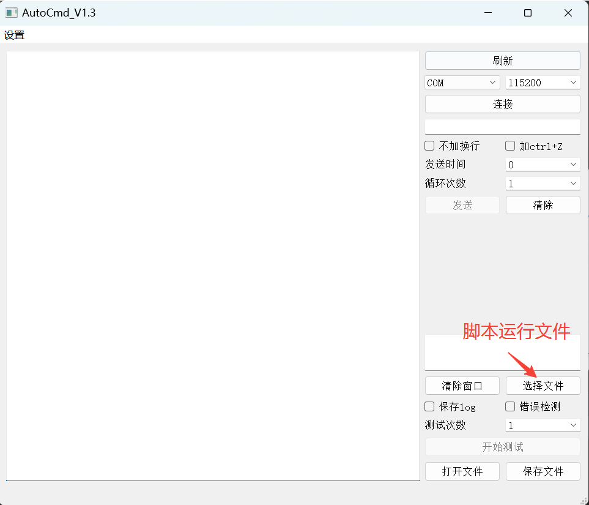
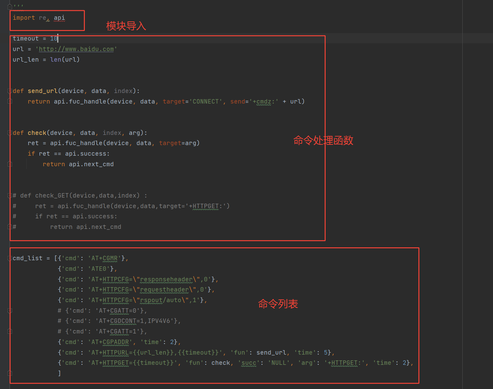
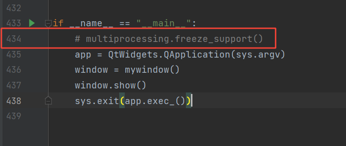

# AtuoCMD

## 软件布局


采用pyQT5做展示界面，做为主进程，单独开启进程跑测试脚本，测试脚本进程通过tcp协议与主进程通信


## 软件界面



## 接口说明 

在**api.py**里面定义以下接口，可方便快速编写测试模块，接口都以**fuc_**开头

一些既定的返回值

```python
success = 0 #找到
goingon = 1 #尚未找到，或者满足条件退出循环测试
stop = 2    #停止
jump = 3    #跳转
next_cmd = 4#下一条命令
```

```python
#check 元组，解析获得的字符串
#ret_list返回查找到符合条件的字符串列表
#send 找到符合字符串之后发送数据，以'+cmd:','+cmdz:','+urc:'开头
#例如target = '+COPS:',check:{0:'0',1:'2',2:"46011",3:'7'}
#找到返回success，找不到返回goingon
def fuc_handle(device,data,target = None, check = None, ret_list=None, send=None)
```

 ```python
#循环测试
#retry_times:测试次数
#send:测试完成后发送数据，以'+cmd:','+cmdz:','+urc:'开头
#succ:判断返回结果成功的标识，检测到返回goingon，即退出循环测试，未检测到，若未到retry_times，返回jump,若到retry_times，返回stop
#err:判断返回结果失败的标识，检测到返回goingon，即退出循环测试，未检测到，若未到retry_times，返回jump,若到retry_times，返回stop
def fuc_retry(device,data,retry_times,succ='OK',err='ERROR', send = None)
 ```

```python
#发送AT命令
#cmd:'AT'开头的命令
def fuc_cmd(device,cmd)
```

```python
#获取从发送命令带ctrl+z   
def fuc_cmdz(device,data)
```

```python
#重新测试，经过time秒后，从index开始测试     
def fuc_reset(device,time,index)
```

## 测试示例



以modem升级用例为例

```python
'''
def fun(device,data,index)
device.print() :在log打印，在log文件中可以看出
device.Send(str):发送字符串str, 命令模式： +cmd:发送内容
                                       +cmdz:发送内容,会自动发送ctrl+z
                                       +exit:time,index 经过time秒后，测试第index条命令
                                       +urc:数据打印在AutoCMD工具中
data :为device返回的一行结果
index :表示当前执行命令的index

{
'cmd': 'ATE0', #命令名称
'fun': fun,    #命令处理函数
'succ': 'OK',  #成功结束命令标志，不定义，默认‘OK’
'err': 'ERROR',#错误结束命令标志,不定义，默认‘ERROR’
'quit': 'ERROR',#错误结束命令并退出测试标志，不定义，不进行检测处理
'time': 2,#延迟2秒发送该命令
'jump':-1#命令跳转，0为当前命令，-1为上一条命令，1为下一条指令，要结合自定义fun返回值jump使用，不定义默认为0
'arg' :fun传入参数
}
'''

import re, api

##AT+COPS?
def check_net(device, data, index):
    # +COPS: 0,2,"46011",7
    ret = api.fuc_handle(device, data, target='+COPS: 0,2')
    if ret == api.success:
        return api.success
    else:
        return api.fuc_retry(device, data, 10)

def check_mqtt_open(device, data, index):
    ret = api.fuc_handle(device, data, target='+MQTTOPEN:0,0')
    if ret == api.success:
        return api.success
    else:
        return api.fuc_retry(device, data, 0, succ='NULL')

def check_mqtt_login(device, data, index):
    ret = api.fuc_handle(device, data, target='MQTTCONN:0,0,0')
    if ret == api.success:
        return api.success
    else:
        return api.fuc_retry(device, data, 0, succ='NULL',send='+cmd:AT+MQTTCLOSE=0')

def update(device, data, index, time):
    ret = api.fuc_handle(device, data, target='OK')
    if ret == api.success:
        return api.fuc_reset(device, time, index + 1)
    else:
        return api.fuc_retry(device, data, 0)

def check_version(device, data, index, version):
    ret = api.fuc_handle(device, data, target=version)
    if ret == api.success:
        return api.success
    else:
        return api.fuc_retry(device, data, 0)


old_version = '2022.03.04_1230'
new_version = '2022.03.04_1830'
#ctwing
ct_url = '\"mqtt.ctwing.cn\"'
ct_port = 1883
ct_device_id = '\"15138225***\"'
ct_password = '\"6FEVlhR8qBlw8EWWlC4qKtj07OrdEUjqNnwt94VcM9Y\"'
ct_taskid = 3876

#命令列表
cmd_list = [{'cmd': 'ATE0'},
            {'cmd': 'AT+CGMR', 'fun': check_version, 'arg': old_version},
            {'cmd': 'AT+COPS?', 'fun': check_net, 'time': 2},
            # ctwing 
            {'cmd': 'AT+MQTTOPEN=0,{{ct_url}},{{ct_port}}', 'fun': check_mqtt_open, 'time': 2},
            {'cmd': 'AT+MQTTCONN=0,{{ct_device_id}},{{ct_device_id}},{{ct_password}}', 'time': 2, 'fun': check_mqtt_login},
            {'cmd': 'AT+CTWINGPOSTVER', 'fun': update, 'arg':180, 'time': 2},
            {'cmd': 'AT+CGMR', 'fun': check_version, 'arg': new_version},
            ]

```

## 打包编译



在**main.py**  434行，若用python运行则不用注释该行

若使用

> ```
> pyinstaller -F main.py -i ./config/AutoCMD2.ico -n AutoCMD_V1.3_nlog --noconsole
> ```

命令打包成exe文件，需要注释该行